# Awesome-AI-Scientists [](https://github.com/sindresorhus/awesome)

A curated list of awesome resources on AI Scientists, based on our survey "A Comprehensive Survey of AI Scientists".


<!--
## News🔥

* **[2024/11/21]** Initial release of our survey is available on [arXiv](https://arxiv.org/abs/2411.14499v1).
* **[2025/07/18]** Initial release of the Awesome-AI-Scientists GitHub repository.
-->

<!--
## Contact📑
If you have any suggestions or find our work helpful, feel free to contact us  
Email: fenglixu@tsinghua.edu.cn
-->

<!--
If this list helps your research, please ⭐ and cite:

```bibtex
@article{ding2025worldmodels,
  title={Understanding World or Predicting Future? A Comprehensive Survey of World Models},
  author={Ding, Jingtao and Zhang, Yunke and Shang, Yu and Zhang, Yuheng and Zong, Zefang and Feng, Jie and Yuan, Yuan and Su, Hongyu and Li, Nian and Sukiennik, Nicholas and Xu, Fengli and Li, Yong},
  journal={ACM Computing Surveys},
  year={2025}
}
```
-->

## Table of Contents 🍃

* [🔬 Functional Roles of AI Scientists](#functional-roles-of-ai-scientists)
  * [🔍 Deep Research](#deep-research)
  * [💡 Ideation](#ideation)
  * [🧪 Autonomous Experiments](#autonomous-experiments)
  * [📊 Scientific Presentation](#scientific-presentation)
  * [⚖️ Research Evaluation](#research-evaluation)
* [🤝 Human-AI Scientist Collaboration](#human-ai-scientist-collaboration)
  * [👤 Human-in-the-Loop](#human-in-the-loop)
  * [🤖 Human-out-of-the-Loop](#human-out-of-the-loop)
* [🌍 AI Scientist by Research Domain](#ai-scientist-by-research-domain)
  * [⚛️ Physical Science](#physical-science)
  * [🧬 Life Science](#life-science)
  * [🏛️ Social Science](#social-science)
  * [💾 Data Science](#data-science)
* [🌱 Broader Impacts of AI Scientists](#broader-impacts-of-ai-scientists)


## Functional Roles of AI Scientists

### Deep Research
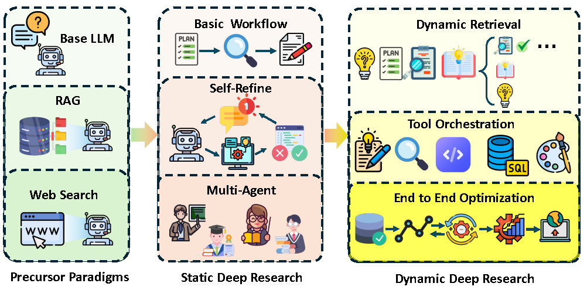


| Title                                                        | Pub. & Date     | Code / Project URL                                           |
| :----------------------------------------------------------- | :-------------- | :----------------------------------------------------------- |
| **[Tongyi DeepResearch: A New Era of Open-Source AI Researchers](https://arxiv.org/abs/2510.24701)** | ArXiv 2025      | [](https://github.com/Alibaba-NLP/DeepResearch) |
| **[Search-R1: Training LLMs to Reason and Leverage Search Engines with Reinforcement Learning](https://arxiv.org/abs/2503.09516)** | ArXiv 2025 | [](https://github.com/PeterGriffinJin/Search-R1) |
| **[WebThinker: Empowering Large Reasoning Models with Deep Research Capability](https://arxiv.org/abs/2504.21776)** | ArXiv 2025      | [](https://github.com/RUC-NLPIR/WebThinker) |
| **[WebDancer: Towards Autonomous Information Seeking Agency](https://arxiv.org/abs/2505.22648)** | ArXiv 2025      | [](https://github.com/Alibaba-NLP/DeepResearch) |
| **[AgentRxiv: Towards Collaborative Autonomous Research](https://arxiv.org/abs/2503.18102)** | ArXiv 2025      | [](https://agentrxiv.github.io/) |
| **[AvaTaR: Optimizing LLM Agents for Tool Usage via Contrastive Reasoning](https://arxiv.org/abs/2406.11200)** | NeurIPS 2024    | [](https://github.com/zou-group/avatar) |
| **[DeepResearch Bench: A Comprehensive Benchmark for Deep Research Agents](https://arxiv.org/abs/2506.11763)** | ArXiv 2025      | [](https://github.com/Ayanami0730/deep_research_bench) |
| **[Open Deep Research (LangChain)](https://github.com/langchain-ai/open_deep_research)** | GitHub 2025     | [](https://github.com/langchain-ai/open_deep_research) |
| **[Introducing Deep Research (OpenAI)](https://openai.com/index/introducing-deep-research/)** | OpenAI 2025     | [Product Page](https://openai.com/index/introducing-deep-research/) |
| **[Sonar Deep Research (Perplexity)](https://docs.perplexity.ai/getting-started/models/models/sonar-deep-research)** | Perplexity 2025 | [Model Card](https://docs.perplexity.ai/getting-started/models/models/sonar-deep-research) |
| **[Qwen Deep Research](https://www.alibabacloud.com/help/en/model-studio/qwen-deep-research)** | Qwen AI 2025    | [Documentation](https://www.alibabacloud.com/help/en/model-studio/qwen-deep-research) |

### Ideation
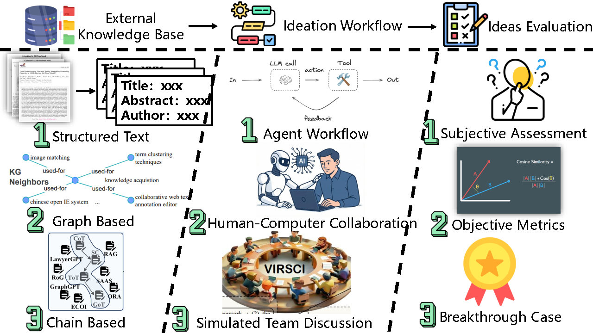
| Title                                                        | Pub.&Date           | Code/Project URL                                             |
| ------------------------------------------------------------ | ------------------- | ------------------------------------------------------------ |
| **[Can LLMs Generate Novel Research Ideas? A Large-Scale Human Study with 100+ NLP Researchers](https://arxiv.org/abs/2409.04109)** | ICLR 2025      | [](https://github.com/NoviScl/AI-Researcher) |
| **[MOOSE-Chem: Large Language Models for Rediscovering Unseen Chemistry Scientific Hypotheses](https://arxiv.org/abs/2410.07076)** | ICLR 2025 | [](https://github.com/ZonglinY/MOOSE-Chem) |
| **[SciMON: Scientific Inspiration Machines Optimized for Novelty](https://arxiv.org/abs/2305.14259)** | ACL 2024      | [](https://github.com/EagleW/Scientific-Inspiration-Machines-Optimized-for-Novelty) |
| **[ResearchAgent: Iterative Research Idea Generation over Scientific Literature with Large Language Models](https://arxiv.org/abs/2404.07738)** | NAACL 2025      | [](https://github.com/JinheonBaek/ResearchAgent) |
| **[Deep Ideation: Designing LLM Agents to Generate Novel Research Ideas on Scientific Concept Network](https://arxiv.org/abs/2511.02238)** | ArXiv 2025      | - |
| **[Chain of Ideas: Revolutionizing Research Via Novel Idea Development with LLM Agents](https://arxiv.org/abs/2410.13185)** | Arxiv 2024    | [](https://github.com/DAMO-NLP-SG/CoI-Agent) |
| **[SciAgents: Automating scientific discovery through multi-agent intelligent graph reasoning](https://arxiv.org/abs/2409.05556)** | ArXiv 2024      | - |
| **[IRIS: Interactive Research Ideation System for Accelerating Scientific Discovery](https://arxiv.org/abs/2504.16728)** | ACL 2025     | [](https://github.com/Anikethh/IRIS-Interactive-Research-Ideation-System) |
| **[IdeaSynth: Iterative Research Idea Development Through Evolving and Composing Idea Facets with Literature-Grounded Feedback](https://arxiv.org/abs/2410.04025)** | CHI 2025     | - |
| **[Many Heads Are Better Than One: Improved Scientific Idea Generation by A LLM-Based Multi-Agent System](https://arxiv.org/abs/2410.09403)** | ACL 2025 | [](https://github.com/Intern-Science/Virtual-Scientists) |
| **[The Virtual Lab of AI agents designs new SARS-CoV-2 nanobodies](https://www.nature.com/articles/s41586-025-09442-9)** | Nature 2025    | [](https://github.com/zou-group/virtual-lab) |
| **[The Ideation-Execution Gap: Execution Outcomes of LLM-Generated versus Human Research Ideas](https://arxiv.org/abs/2506.20803)** | Arxiv 2025    | [](https://github.com/NoviScl/AI-Researcher) |

### Autonomous Experiments
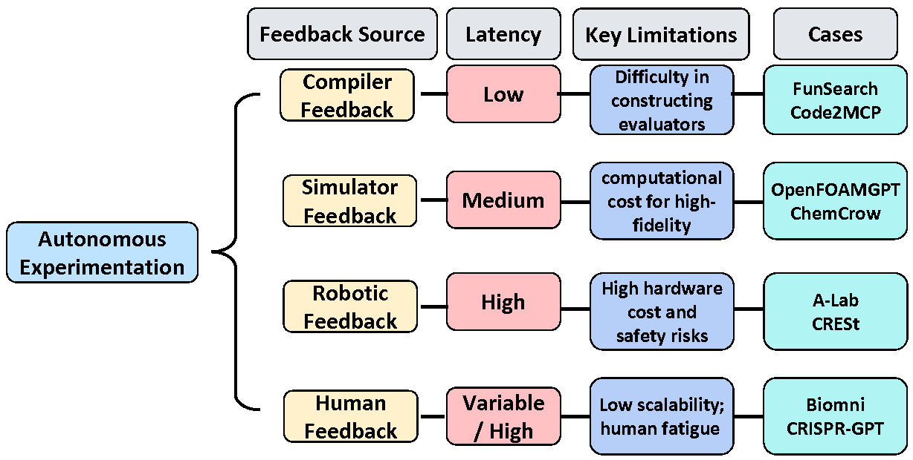
| Title | Category | Publication & Year | Code / Project URL |
|---|---|---|---|
| [Code2MCP: Transforming Code Repositories into MCP Services](https://arxiv.org/abs/2509.05941) | Compiler | arXiv 2025 | [Code](https://github.com/DEFENSE-SEU/Code2MCP) |
| [Paper2Agent: Reimagining Research Papers As Interactive and Reliable AI Agents](https://arxiv.org/abs/2509.06917) | Compiler | arXiv 2025 | [Code](https://github.com/jmiao24/Paper2Agent) |
| [EnvX: Agentize Everything with Agentic AI](https://arxiv.org/abs/2509.08088) | Compiler | arXiv 2025 | - |
| [Paper2Code: Automating Code Generation from Scientific Papers in Machine Learning](https://arxiv.org/abs/2504.17192) | Compiler | arXiv 2025 | [Code](https://github.com/going-doer/Paper2Code) |
| [Mathematical discoveries from program search with large language models](https://www.nature.com/articles/s41586-023-06924-6) | Compiler | Nature 2024 | [Code](https://github.com/google-deepmind/funsearch) |
| [AlphaEvolve: A coding agent for scientific and algorithmic discovery](https://arxiv.org/abs/2506.13131) | Compiler | arXiv 2025 | [Blog](https://deepmind.google/blog/alphaevolve-a-gemini-powered-coding-agent-for-designing-advanced-algorithms/) |
| [X-evolve: Solution space evolution powered by large language models](https://arxiv.org/abs/2508.07932) | Compiler | arXiv 2025 | [Code](https://github.com/zhaiyi000/x-evolve) |
| [ShinkaEvolve: Towards Open-Ended And Sample-Efficient Program Evolution](https://arxiv.org/abs/2509.19349) | Compiler | arXiv 2025 | [Code](https://github.com/SakanaAI/ShinkaEvolve) |
| [DeepScientist: Advancing Frontier-Pushing Scientific Findings Progressively](https://arxiv.org/abs/2509.26603) | Compiler | arXiv 2025 | [Code](https://github.com/ResearAI/DeepScientist) |
| [OpenFOAMGPT 2.0: end-to-end, trustworthy automation for computational fluid dynamics](https://arxiv.org/abs/2504.19338) | Simulator | arXiv 2025 | - |
| [ChemCrow: Augmenting large-language models with chemistry tools](https://www.nature.com/articles/s42256-024-00832-8) | Simulator | Nat. Mach. Intell. 2024 | [Code](https://github.com/ur-whitelab/chemcrow-public) |
| [A mobile robotic chemist](https://www.nature.com/articles/s41586-020-2442-2) | Robot | Nature 2020 | [BitBucket](https://bitbucket.org/ben_burger/kuka_workflow) |
| [An autonomous laboratory for the accelerated synthesis of novel materials](https://www.nature.com/articles/s41586-023-06734-w) | Robot | Nature 2023 | - |
| [Autonomous chemical research with large language models](https://www.nature.com/articles/s41586-023-06792-0) | Robot | Nature 2023 | [Code](https://github.com/gomesgroup/coscientist) |
| [A multimodal robotic platform for multi-element electrocatalyst discovery](https://www.nature.com/articles/s41586-025-09640-5) | Robot | Nature 2025 | [Code](https://github.com/zhang21mit/CRESt) |
| [Biomni: A general-purpose biomedical AI agent](https://doi.org/10.1101/2025.05.30.656746 ) | human | biorXiv2025 | [](https://biomni.stanford.edu/) |
| [CRISPR-GPT for agentic automation of gene-editing experiments](https://doi.org/10.1038/s41551-025-01463-z) | human | Nature Biomedical Engineering 2025 | - |
| [Towards an AI co-scientist](https://arxiv.org/abs/2502.18864) | human | arXiv 2025 | - |
| [Robin: A multi-agent system for automating scientific discovery](https://arxiv.org/abs/2505.13400) | human | arXiv 2025 | [Code](https://github.com/Future-House/robin/?tab=readme-ov-file) |
| [What is the Model Conetext Protocol(MCP)?](https://modelcontextprotocol.io/docs/getting-started/intro) | Platform & Protocol | 2025 | [GitHub](https://github.com/modelcontextprotocol) |
| [Democratizing AI scientists using ToolUniverse](https://arxiv.org/abs/2509.23426) | Platform & Protocol | arXiv 2025 | [](https://aiscientist.tools/) |
| [Scientific Intelligence Context Protocol(SCP)](https://github.com/open-sciencelab/scp) | Platform & Protocol | 2025 | [Code](https://github.com/open-sciencelab/scp) |

### Scientific Presentation
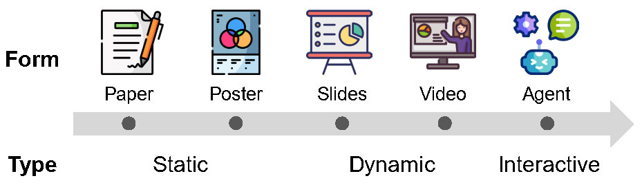
| Title                                                        | Pub.&Date           | Code/Project URL                                             |
| ------------------------------------------------------------ | ------------------- | ------------------------------------------------------------ |
| [The AI Scientist: Towards Fully Automated Open-Ended Scientific Discovery  **(AI Scientist)**](https://arxiv.org/abs/2408.06292) | arxiv 2024 | [](https://github.com/SakanaAI/AI-Scientist) |
| [The AI Scientist-v2: Workshop-Level Automated Scientific Discovery via Agentic Tree Search  **(AI Scientist-v2)**](https://arxiv.org/abs/2504.08066) | arxiv 2025 | [](https://github.com/SakanaAI/AI-Scientist-v2) |
| [AI-Researcher: Autonomous Scientific Innovation  **(AI-Researcher)**](https://arxiv.org/abs/2505.18705) | arxiv 2025 | [](https://github.com/HKUDS/AI-Researcher) |
| [Agent Laboratory: Using LLM Agents as Research Assistants  **(Agent Laboratory)**](https://arxiv.org/abs/2501.04227) | arxiv 2025 | [](https://github.com/SamuelSchmidgall/AgentLaboratory) |
| [AgentRxiv: Towards Collaborative Autonomous Research  **(AgentRxiv)**](https://arxiv.org/abs/2503.18102) | arxiv 2025 | [](https://agentrxiv.github.io/) |
| [Autonomous LLM-Driven Research — from Data to Human-Verifiable Research Papers **(data-to-paper)**](https://arxiv.org/abs/2404.17605) | NEJM AI 2025 | [](https://github.com/Technion-Kishony-lab/data-to-paper) |
| [Zochi technical report  **(Zochi)**](https://github.com/IntologyAI/Zochi/blob/main/Zochi_Technical_Report.pdf) | 2025 | [](https://github.com/IntologyAI/Zochi) |
| [CycleResearcher: Improving Automated Research via Automated Review  **(CycleResearcher)**](https://arxiv.org/abs/2411.00816) | ICLR 2025 | [](https://github.com/zhu-minjun/Researcher) |
| [AutoSurvey: Large Language Models Can Automatically Write Surveys  **(AutoSurvey)**](https://arxiv.org/abs/2406.10252) | NeurIPS 2024 | [](https://github.com/AutoSurveys/AutoSurvey) |
| [SURVEYFORGE: On the Outline Heuristics, Memory-Driven Generation, and Multi-dimensional Evaluation for Automated Survey Writing  **(SURVEYFORGE)**](https://aclanthology.org/2025.acl-long.609/) | ACL 2025 | [](https://github.com/Alpha-Innovator/SurveyForge) |
| [SurveyX: Academic Survey Automation via Large Language Models  **(SurveyX)**](https://arxiv.org/abs/2502.14776) | arxiv 2025 | [](https://github.com/IAAR-Shanghai/SurveyX) |
| [Paper2Poster: Towards Multimodal Poster Automation from Scientific Papers  **(Paper2Poster)**](https://arxiv.org/abs/2505.21497) | NeurIPS 2025 | [](https://github.com/Paper2Poster/Paper2Poster) |
| [PPTAgent: Generating and Evaluating Presentations Beyond Text-to-Slides  **(PPTAgent)**](https://aclanthology.org/2025.emnlp-main.728/) | EMNLP 2025 | [](https://github.com/icip-cas/PPTAgent) |
| [PresentAgent: Multimodal Agent for Presentation Video Generation  **(PresentAgent)**](https://aclanthology.org/2025.emnlp-demos.58/) | EMNLP 2025 | [](https://github.com/AIGeeksGroup/PresentAgent) |
| [Paper2Video: Automatic Video Generation from Scientific Papers  **(Paper2Video)**](https://arxiv.org/abs/2510.05096) | SEA @ NeurIPS 2025 | [](https://github.com/showlab/Paper2Video) |
| [Paper2Agent: Reimagining Research Papers As Interactive and Reliable AI Agents  **(Paper2Agent)**](https://arxiv.org/abs/2509.06917) | arxiv 2025 | [](https://github.com/jmiao24/Paper2Agent) |

### Research Evaluation
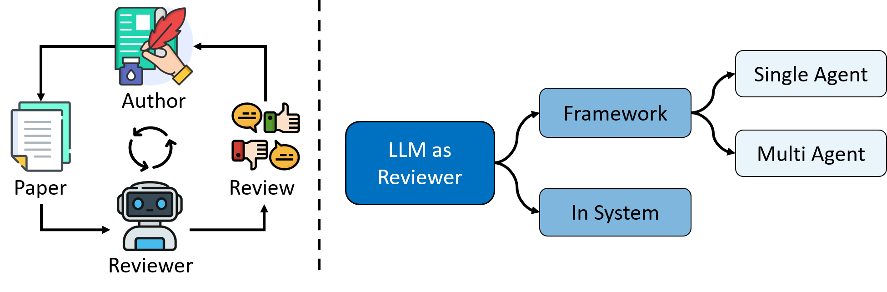
| Title                                                        | Pub.&Date           | Code/Project URL                                             |
| ------------------------------------------------------------ | ------------------- | ------------------------------------------------------------ |
| [Automated Peer Reviewing in Paper SEA: Standardization, Evaluation, and Analysis  **(SEA)**](https://arxiv.org/abs/2407.12857) | EMNLP 2025 | [](https://github.com/ecnu-sea/sea) |
| [Deepreview: Improving llm-based paper review with human-like deep thinking process  **(Deepreview)**](https://arxiv.org/abs/2503.08569) | ACL 2025 | [](https://github.com/zhu-minjun/Researcher) |
| [TreeReview: A Dynamic Tree of Questions Framework for Deep and Efficient LLM-based Scientific Peer Review  **(Treereview)**](https://arxiv.org/abs/2506.07642) | EMNLP 2025 | [](https://github.com/YuanChang98/tree-review) |
| [GraphEval: A Lightweight Graph-Based LLM Framework for Idea Evaluation  **(GraphEval)**](https://arxiv.org/abs/2503.12600) | ICLR 2025 | [](https://github.com/ulab-uiuc/GraphEval) |
| [Marg: Multi-agent review generation for scientific papers  **(MARG)**](https://arxiv.org/abs/2401.04259) | arxiv 2024 | [](https://github.com/allenai/marg-reviewer) |
| [Automated Focused Feedback Generation for Scientific Writing Assistance](https://arxiv.org/abs/2405.20477) | ACL 2024 | [](https://github.com/ericchamoun/FocusedFeedbackGeneration) |
| [Peer Review as A Multi-Turn and Long-Context Dialogue with Role-Based Interactions  **(ReviewMT)**](https://arxiv.org/abs/2406.05688) | arxiv 2024 | [](https://github.com/chengtan9907/ReviewMT) |
| [PRE: A Peer Review Based Large Language Model Evaluator  **(PRE)**](https://arxiv.org/abs/2401.15641) | arxiv 2024 | [](https://github.com/THUIR/LLM_Eval) |
| [PaperEval: A universal, quantitative, and explainable paper evaluation method powered by a multi-agent system  **(PaperEval)**](https://www.sciencedirect.com/science/article/pii/S0306457325001669) | Information Processing & Management 2025 |  |
| [AgentReview: Exploring peer review dynamics with LLM agents  **(AgentReview)**](https://arxiv.org/abs/2406.12708) | EMNLP 2024 | [](https://github.com/Ahren09/AgentReview) |
| [CycleResearcher: Improving Automated Research via Automated Review  **(CycleResearcher)**](https://arxiv.org/abs/2411.00816) | ICLR 2025 | [](https://github.com/zhu-minjun/Researcher) |
| [The AI Scientist: Towards Fully Automated Open-Ended Scientific Discovery  **(AI Scientist)**](https://arxiv.org/abs/2408.06292) | arxiv 2024 | [](https://github.com/SakanaAI/AI-Scientist) |
| [The AI Scientist-v2: Workshop-Level Automated Scientific Discovery via Agentic Tree Search  **(AI Scientist-v2)**](https://arxiv.org/abs/2504.08066) | arxiv 2025 | [](https://github.com/SakanaAI/AI-Scientist-v2) |

## Human-AI Scientist Collaboration
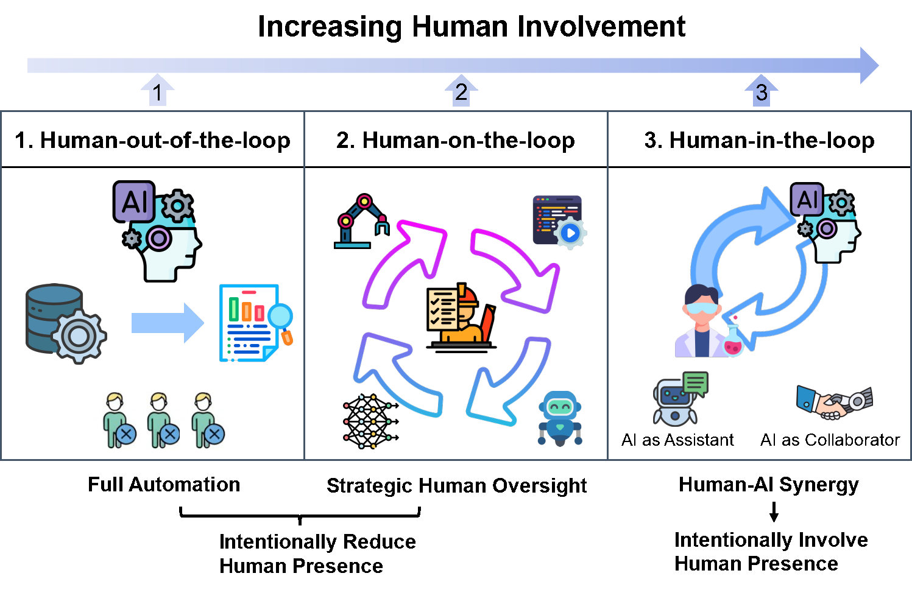
### Human-in-the-Loop
| Title                                                        | Pub.&Date           | Code/Project URL                                             |
| ------------------------------------------------------------ | ------------------- | ------------------------------------------------------------ |
| [DiscipLink: Unfolding Interdisciplinary Information Seeking Process via Human-AI Co-Exploration  **(DiscipLink)**](https://dl.acm.org/doi/abs/10.1145/3654777.3676366) | UIST 2024 | - |
| [ConvXAI : Delivering Heterogeneous AI Explanations via Conversations to Support Human-AI Scientific Writing  **(ConvXAI)**](https://dl.acm.org/doi/abs/10.1145/3584931.3607492) | CSCW 2023 | [](https://github.com/huashen218/convxai) |
| [Agent Laboratory: Using LLM Agents as Research Assistants  **(Agent Laboratory)**](https://arxiv.org/abs/2501.04227) | arXiv 2025 | [](https://github.com/SamuelSchmidgall/AgentLaboratory) |
| [Towards an AI co-scientist  **(AI co-scientist)**](https://arxiv.org/abs/2502.18864) | arxiv 2025 | - |
| [AI mirrors experimental science to uncover a mechanism of gene transfer crucial to bacterial evolution](https://www.cell.com/cell/fulltext/S0092-8674%2825%2900973-0?utm) | Cell 2025 | - |
| [How AI Processing Delays Foster Creativity: Exploring Research Question Co-Creation with an LLM-based Agent  **(CoQuest)**](https://dl.acm.org/doi/full/10.1145/3613904.3642698) | CHI 2024 | [](https://github.com/yiren-liu/coquest) |
| [IdeaSynth: Iterative Research Idea Development Through Evolving and Composing Idea Facets with Literature-Grounded Feedback  **(IdeaSynth)**](https://dl.acm.org/doi/full/10.1145/3706598.3714057) | CHI 2025 | - |

### Human-out-of-the-Loop
| Title                                                        | Pub.&Date           | Code/Project URL                                             | 
| ------------------------------------------------------------ | ------------------- | ------------------------------------------------------------ |
| [The AI Scientist: Towards Fully Automated Open-Ended Scientific Discovery  **(AI Scientist)**](https://arxiv.org/abs/2408.06292) | arxiv 2024 | [](https://github.com/SakanaAI/AI-Scientist) |
| [The AI Scientist-v2: Workshop-Level Automated Scientific Discovery via Agentic Tree Search  **(AI Scientist-v2)**](https://arxiv.org/abs/2504.08066) | arxiv 2025 | [](https://github.com/SakanaAI/AI-Scientist-v2) |
| [Zochi technical report  **(Zochi)**](https://github.com/IntologyAI/Zochi/blob/main/Zochi_Technical_Report.pdf) | 2025 | [](https://github.com/IntologyAI/Zochi) |

## AI Scientist by Research Domain
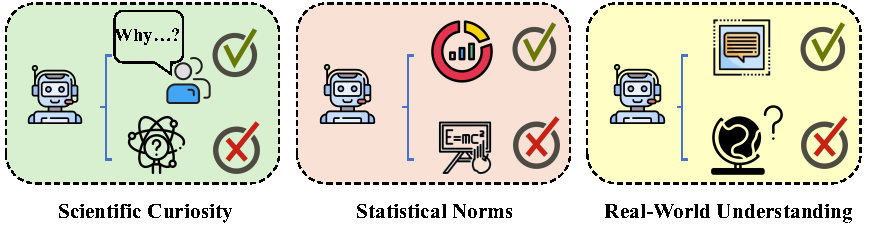
### Physical Science
| Title                                                        | Pub.&Date           | Code/Project URL                                             |
| ------------------------------------------------------------ | ------------------- | ------------------------------------------------------------ |
| [Augmenting large language models with chemistry tools](<https://www.nature.com/articles/s42256-024-00832-8>) | Nature Machine Intelligence, 2024 |None  |
| [Autonomous chemical research with large language models.](<https://www.nature.com/articles/s41586-023-06792-0>) | Nature, 2023 | [](https://github.com/gomesgroup/coscientist) |
| [The Virtual Lab of AI Agents Designs New SARS-CoV-2 Nanobodies **(VirtualLab)**](<https://www.nature.com/articles/s41586-025-09442-9>) | Nature, 2025 | [](https://github.com/zou-group/virtual-lab) |
| [A Bayesian machine scientist to aid in the solution of challenging scientific problems](<https://www.science.org/doi/full/10.1126/sciadv.aav6971>) | Science advances, 2020 | None |
| [AI Feynman: A physics-inspired method for symbolic regression **(AI Feynman)**](<https://www.science.org/doi/full/10.1126/sciadv.aay2631>) | Science advances, 2020 | [](https://github.com/SJ001/AI-Feynman) |
| [Deep symbolic regression for physics guided by units constraints: toward the automated discovery of physical law](<https://iopscience.iop.org/article/10.3847/1538-4357/ad014c/meta>) | The Astrophysical, 2023 | None |
| [A neural symbolic model for space physics](<https://www.nature.com/articles/s42256-025-01126-3>) | Nature Machine Intelligence, 2025 | [](https://github.com/Jie0618/PhysicsRegression) |
| [MOOSE-Chem: Large Language Models for Rediscovering Unseen Chemistry Scientific Hypotheses **(MOOSE-Chem)**](<https://openreview.net/forum?id=X9OfMNNepI>) | ICLR, 2025 | [](https://github.com/ZonglinY/MOOSE-Chem) |
| [Beyond designer’s knowledge: Generating materials design hypotheses via a large language model](<https://www.sciencedirect.com/science/article/pii/S1359645425005932>) | Acta Materialia, 2025 | None |
| [MOOSE-Chem2: Exploring LLM Limits in Fine-Grained Scientific Hypothesis Discovery via Hierarchical Search](<https://arxiv.org/pdf/2505.19209>) | arXiv:2505.19209, 2025 | [](https://github.com/ZonglinY/MOOSE-Chem2) |
| [AI-Newton: A Concept-Driven Physical Law Discovery System without Prior Physical Knowledge](<https://arxiv.org/pdf/2504.01538?>) | Nature News(<https://www.nature.com/articles/d41586-025-03659-4>), 2025 |[](https://github.com/Science-Discovery/AI-Newton) |
| [MOOSE-Chem3: Toward Experiment-Guided Hypothesis Ranking via Simulated Experimental Feedback](<https://arxiv.org/pdf/2505.17873>) | arXiv:2505.17873, 2025 | [](https://github.com/wanhaoliu/MOOSE-Chem3) |
| [EarthLink: A Self-Evolving AI Agent for Climate Science](<https://arxiv.org/pdf/2507.17311?>) | arXiv:2507.17311?, 2025 | [Homepage](https://earthlink.intern-ai.org.cn) |
| [EarthSE: A Benchmark Evaluating Earth Scientific Exploration Capability for Large Language Models](<https://arxiv.org/pdf/2505.17139>) | arXiv:2505.17139, 2025 | [Huggingface Page](https://huggingface.co/ai-earth) |


### Life Science
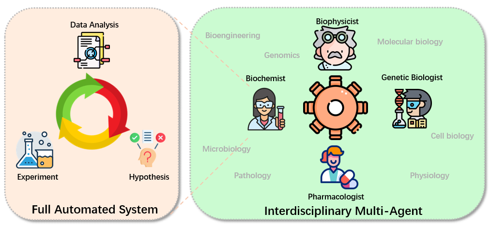
| Title                                                        | Pub.&Date           | Code/Project URL                                             |
| ------------------------------------------------------------ | ------------------- | ------------------------------------------------------------ |
| [BioInformatics Agent (BIA): Unleashing the Power of Large Language Models to Reshape Bioinformatics Workflow **(BIA)**](<https://www.biorxiv.org/content/10.1101/2024.05.22.595240v2.abstract>) | Bioinformatics, 2025 |[](https://github.com/biagent-dev/bia)  |
| [Cellagent: An LLM-Driven Multi-Agent Framework for Automated Single-Cell Data Analysis **(CellAgent)**](<https://arxiv.org/abs/2407.09811>) | arXiv:2407.09811, 2024 | [Homepage](http://cell.agent4science.cn/) |
| [CRISPR-GPT: An LLM Agent for Automated Design of Gene-Editing Experiments **(CRISPR-GPT)**](<https://arxiv.org/html/2404.18021v1>) | arXiv:2404.18021, 2024 | None |
| [PerTurboAgent: A Self-Planning Agent for Boosting Sequential Perturb-Seq Experiments **(PerTurboAgent)**](<https://www.biorxiv.org/content/10.1101/2025.05.25.656020v1>) | bioRxiv, 2025 | None|
| [BiodiscoveryAgent: An AI Agent for Designing Genetic Perturbation Experiments **(BiodiscoveryAgent)**](<https://arxiv.org/abs/2405.17631>) | arXiv:2405.17631, 2024 | [](https://github.com/snap-stanford/BioDiscoveryAgent) |
| [AI Mirrors Experimental Science to Uncover a Mechanism of Gene Transfer Crucial to Bacterial Evolution ](<https://www.sciencedirect.com/science/article/pii/S0092867425009730>) | Cell, 2025 | None |
| [Scientific Hypothesis Generation by a Large Language Model: Laboratory Validation in Breast Cancer Treatment **(LLM-Hypothesis)**](<https://arxiv.org/abs/2405.12258>) | Journal of the Royal Society Interface, 2025 | None |
| [SpatialAgent: An Autonomous AI Agent for Spatial Biology **(SpatialAgent)**](<https://www.biorxiv.org/content/10.1101/2025.04.03.646459v1>) | bioRxiv, 2025 | [](https://github.com/Genentech/SpatialAgent) |
| [BioMaster: Multi-Agent System for Automated Bioinformatics Analysis Workflow **(BioMaster)**](<https://www.biorxiv.org/content/10.1101/2025.01.23.634608v1>) | bioRxiv, 2025 | [](https://github.com/ai4nucleome/BioMaster/tree/master) |
| [Biomni: A General-Purpose Biomedical AI Agent Integrating 25 Domains to Generate Hypotheses **(Biomni)**](<https://biomni.stanford.edu/paper.pdf>) | bioRxiv, 2025 | [](https://github.com/snap-stanford/biomni) |
| [STELLA: Self-Evolving LLM Agent for Biomedical Research **(STELLA)**](<https://arxiv.org/abs/2507.02004>) | arXiv:2507.02004, 2025 | [](https://github.com/zaixizhang/STELLA) |
| [The Virtual Lab of AI Agents Designs New SARS-CoV-2 Nanobodies **(VirtualLab)**](<https://www.nature.com/articles/s41586-025-09442-9>) | Nature, 2025 | [](https://github.com/zou-group/virtual-lab) |
| [Proteus: Automating Exploratory Proteomics Research via Language Models **(Proteus)**](<https://arxiv.org/abs/2411.03743>) | arXiv:2504.12345, 2025 | None |
### Social Science
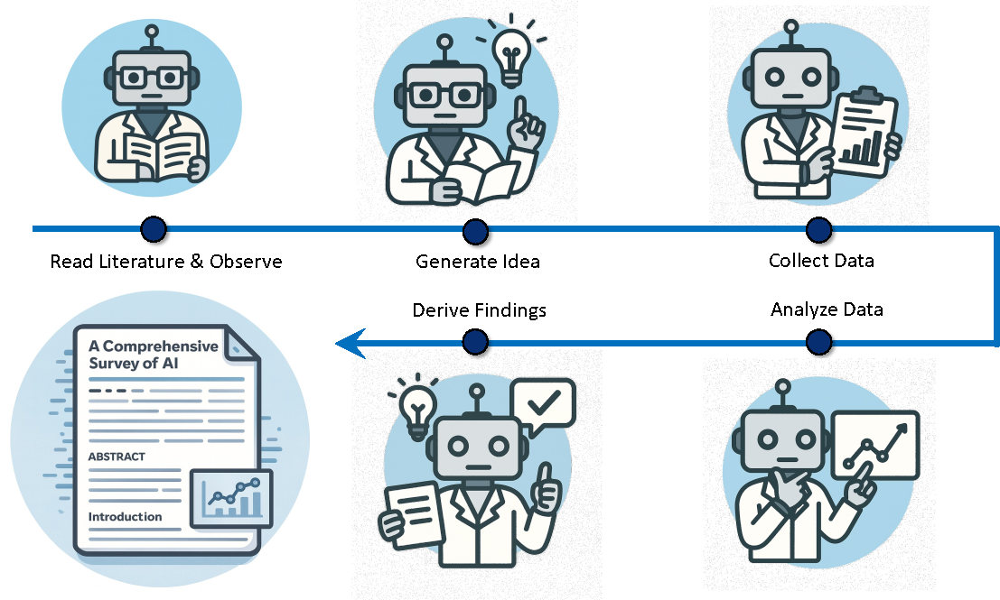
| Title | Pub.&Date | Code/Project URL |
| :--- | :--- | :--- |
| [Literature meets data: A synergistic approach to hypothesis generation](https://aclanthology.org/2025.acl-long.12/) | ACL 2025 | [](https://github.com/ChicagoHAI/hypothesis-generation) |
| [Generative agent simulations of 1,000 people](https://arxiv.org/abs/2411.10109) | arXiv 2024 | [](https://github.com/joonspk-research/generative_agents) |
| [A large-scale replication of scenario-based experiments in psychology and management using large language models](https://www.nature.com/articles/s43588-025-00627-y) | Nat. Comput. Sci. 2025 | [Codes](https://osf.io/j6wmn/) |
| [The AI Economist: Taxation policy design via two-level deep multiagent reinforcement learning](https://www.science.org/doi/10.1126/sciadv.abk2607) | Sci. Adv. 2022 | [](https://github.com/salesforce/ai-economist) |
| [LLM Economist: Large Population Models and Mechanism Design in Multi-Agent Generative Simulacra](https://arxiv.org/abs/2507.15815) | arXiv 2025 | [](https://github.com/sethkarten/LLM-Economist) |
| [EconGym: A Scalable AI Testbed with Diverse Economic Tasks](https://arxiv.org/abs/2506.12110) | NeurIPS 2025 | [](https://github.com/Miracle1207/EconGym) |
| [REPRO-BENCH: Can Agentic AI Systems Assess the Reproducibility of Social Science Research?](https://aclanthology.org/2025.findings-acl.1210/) | ACL 2025 (Findings) | [](https://github.com/uiuc-kang-lab/REPRO-Bench) |
| [Automated Social Science: Language Models as Scientist and Subjects](https://www.nber.org/papers/w32439) | NBER 2024 | [](https://github.com/KeHang-Zhu/lm-automated-social-science) |
| [YuLan-OneSim: Towards the Next Generation of Social Simulator with Large Language Models](https://arxiv.org/abs/2412.00000) | Workshop 2025 | [](https://github.com/RUC-GSAI/YuLan-OneSim) |

### Data Science
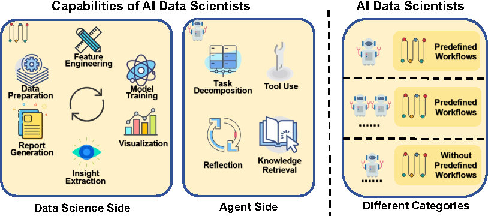
| Title                                                        | Pub.&Date           | Code/Project URL                                             |
| ------------------------------------------------------------ | ------------------- | ------------------------------------------------------------ |
| [DS-Agent: Automated Data Science by Empowering Large Language Models with Case-Based Reasoning  **(DS-Agent)**](https://dl.acm.org/doi/abs/10.5555/3692070.3692738) | ICML2024               | [](https://github.com/guosyjlu/DS-Agent) |
| [Dagent: A relational database-driven data analysis report generation agent  **(Dagent)**](https://arxiv.org/abs/2503.13269) | Arxiv 2025              | None |
| [Data Interpreter: An LLM Agent For Data Science  **(Data Interpreter)**](https://aclanthology.org/2025.findings-acl.1016/) | ACL 2025（Findings）             | [](https://docs.deepwisdom.ai/main/en/guide/use_cases/agent/interpreter/intro.html) |
| [Exploring LLM agents for cleaning tabular machine learning datasets ](https://arxiv.org/abs/2503.06664) | ICLR 2025 Workshop          | None |
| [AutoKaggle: A Multi-Agent Framework for Autonomous Data Science Competitions  **(AutoKaggle)**](https://orbilu.uni.lu/handle/10993/64877) | ICLR2025               | [](https://github.com/multimodal-art-projection/AutoKaggle) |
| [AutoML-Agent: A Multi-Agent LLM Framework for Full-Pipeline AutoML  **(AutoML-Agent)**](https://arxiv.org/abs/2410.02958) | ICML2025              | [](https://github.com/deepauto-ai/automl-agent) |
| [LAMBDA: A Large Model Based Data Agent  **(LAMBDA)**](https://www.tandfonline.com/doi/full/10.1080/01621459.2025.2510000#abstract) | Journal of the American Statistical Association 2025             | [](https://github.com/AMA-CMFAI/LAMBDA) |
| [MAGIS: LLM-Based Multi-Agent Framework for GitHub Issue ReSolution  **(MAGIS)**](https://proceedings.neurips.cc/paper_files/paper/2024/hash/5d1f02132ef51602adf07000ca5b6138-Abstract-Conference.html) | NeurIPS2025               | [](https://github.com/co-evolve-lab/magis) |
| [Budgetmlagent: A cost-effective LLM multi-agent system for automating machine learning tasks  **(Budgetmlagent)**](https://dl.acm.org/doi/full/10.1145/3703412.3703416) | AIMLSystems '24              | None |
| [From data to story: Towards automatic animated data video creation with LLM-based multi-agent systems ](https://ieeexplore.ieee.org/abstract/document/10766492) | 2024 IEEE VIS Workshop           | None |
| [DeepAnalyze: Agentic Large Language Models for Autonomous Data Science  **(DeepAnalyze)**](https://arxiv.org/abs/2510.16872) | Arxiv 2025             | [](https://github.com/ruc-datalab/DeepAnalyze) |

## Broader Impacts of AI Scientists
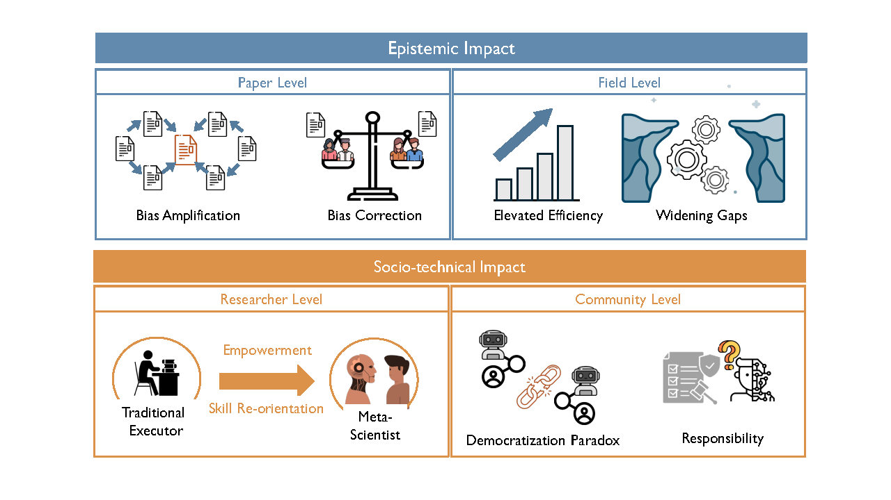
| Title                                                        | Pub.&Date           | Code/Project URL                                             |
| ------------------------------------------------------------ | ------------------- | ------------------------------------------------------------ |
| [Large language models reflect human citation patterns with a heightened citation bias **(Citation Bias)**](https://arxiv.org/abs/2405.15739) | NAACL Findings 2025 | [](https://github.com/AndresAlgaba/LLM_citation_patterns) |
| [How Deep Do Large Language Models Internalize Scientific Literature and Citation Practices **(Citation Practices)**](https://arxiv.org/abs/2504.02767) | arXiv 2025 | [](https://github.com/AndresAlgaba/LLMs_scientific_literature) |
| [Who Gets Recommended? Investigating Gender, Race, and Country Disparities in Paper Recommendations from Large Language Models **(LLM Recommendations Fairness)**](https://arxiv.org/abs/2406.12815) | arXiv 2024 | None |
| [AI–AI bias: Large language models favor communications generated by large language models **(AI–AI Bias)**](https://www.pnas.org/doi/10.1073/pnas.2415697122) | PNAS 2025 | [](https://github.com/lauritowal/ai-ai-bias) |
| [AI Expands Scientists' Impact but Contracts Science's Focus **(Impact vs. Focus)**](https://arxiv.org/abs/2412.07727) | arXiv 2024 |  [](https://github.com/tsinghua-fib-lab/AI-Impacts-Science) |
| [Quantifying the use and potential benefits of artificial intelligence in scientific research **(AI in Scientific Practice)**](https://www.nature.com/articles/s41562-024-02020-5) | Nat. Hum. Behav. 2024 | [Code](https://kellogg-cssi.github.io/ai4science/) |
| [Can GenAI Improve Academic Performance? Evidence from the Social and Behavioral Sciences **(GenAI & Education)**](https://arxiv.org/abs/2510.02408) | arXiv 2025 | None |
| [LLM4SR: A Survey on Large Language Models for Scientific Research **(LLM4SR)**](https://arxiv.org/abs/2501.04306) | arXiv 2025 | [](https://github.com/du-nlp-lab/LLM4SR) |
| [The Role of AI in Facilitating Interdisciplinary Collaboration: Evidence from AlphaFold **(AlphaFold & Collaboration)**](https://www.arxiv.org/abs/2508.13234) | arXiv 2025 | None |
| [AI for Scientific Discovery is a Social Problem **(AI & Scientific Institutions)**](https://arxiv.org/abs/2509.06580) | arXiv 2025 | None |
| [Artificial intelligence in science – Promises or perils for creativity? **(AI & Creativity)**](https://data.europa.eu/doi/10.2777/6693925) | EU Policy Report 2025 | None |
